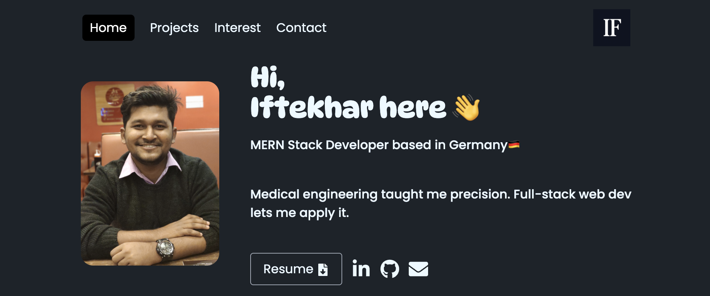

# Developer Portfolio – Iftekharul Alam

Welcome to my personal portfolio website! This project showcases my work, skills, and background as a full-stack developer. The site is built using modern frontend technologies and is fully responsive across all devices.

 

## 🔧 Technologies Used

- **React.js** – JavaScript library for building user interfaces
- **Vite** – Fast development build tool
- **Tailwind CSS** – Utility-first CSS framework for styling
- **EmailJS** – Send emails directly from frontend
- **React Icons** – Icon library for React
- **React Router** – For client-side routing

## 🚀 Features

- A clean and responsive landing page
- Project showcase section with links to GitHub/live demos
- Skills section with animated technology icons
- Contact form powered by EmailJS
- Smooth scrolling and interactive UI animations
- Modern and fast page loading with Vite

## 📦 Dependencies

```bash
"dependencies": {
  "emailjs-com": "^3.2.0",
  "react": "^18.x",
  "react-dom": "^18.x",
  "react-icons": "^4.x",
  "react-router-dom": "^6.x",
  "vite": "^5.x"
}
```

## 🛠️ Run Locally

Follow the steps below to run this project on your local machine:

```bash
# Clone the repository
git clone https://github.com/iftekhar08019/iftehar_portfolio.git

# Navigate into the project folder
cd iftehar_portfolio

# Install dependencies
npm install

# Run the development server
npm run dev
```

The site will be available at: `http://localhost:5173`

## 🔗 Live Demo

Check out the live version here:  
👉 [https://iftekhar-web.web.app](https://iftekhar-web.web.app)

## 📁 Folder Structure

```
iftehar_portfolio/
│
├── public/
├── src/
│   ├── assets/
│   ├── components/
│   ├── pages/
│   └── App.jsx
├── index.html
├── tailwind.config.js
└── vite.config.js
```

## 📬 Contact

Feel free to connect with me on [LinkedIn](https://www.linkedin.com/in/mdiftekharulalam21/) or reach out via the contact form on the website.
